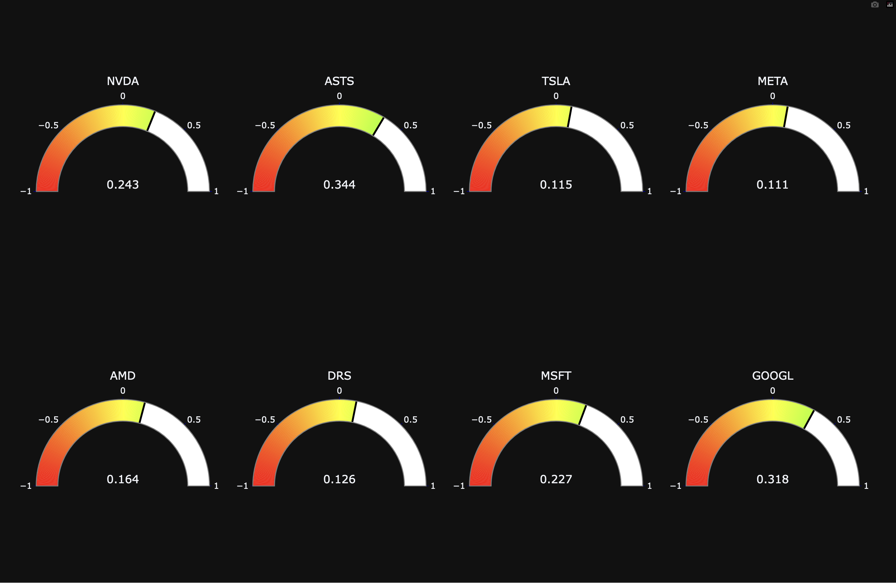

# Stock Sentiment Analysis Project



This project performs sentiment analysis on Reddit posts and comments to gauge public opinion on various stocks. The analysis utilizes Natural Language Processing (NLP) techniques and visualizes the results using interactive gauges created with Plotly.

## Table of Contents

- [Technologies Used](#technologies-used)
- [Installation](#installation)
- [Data Procurement](#data-procurement)
- [Reddit Data Extraction](#reddit-data-extraction)
- [Sentiment Analysis](#sentiment-analysis)
- [Stock Sentiment Analysis](#stock-sentiment-analysis)
- [Visualization](#visualization)
- [Usage](#usage)
- [Notes](#notes)

## Technologies Used

- **Python**: The primary programming language used.
- **Requests**: For making HTTP requests to the NASDAQ API.
- **Pandas**: For data manipulation and analysis.
- **PRAW (Python Reddit API Wrapper)**: For accessing Reddit’s API.
- **NLTK (Natural Language Toolkit)**: For sentiment analysis.
- **Matplotlib & Plotly**: For data visualization.

## Installation

**1. Clone the Repository**
```
git clone https://github.com/yourusername/stock-sentiment-analysis.git
cd stock-sentiment-analysis
```
**2. Install Dependencies**
```
pip install requests pandas praw nltk matplotlib numpy plotly python-dotenv
pip install -U kaleido
```
**3. Download NLTK Data**
```
import nltk
nltk.download('vader_lexicon')
```
If you encounter an SSL error, you may need to:
```
pip install certifi
export SSL_CERT_FILE=$(python -m certifi)
source ~/.bash_profile
```

## Data Procurement

The `data_procurement()` function fetches stock data from the NASDAQ API and stores it in a CSV file named `Stocks.csv`. This data includes the symbols of the top 1000 stocks, which are used in sentiment analysis.

## Reddit Data Extraction

The `reddit_data()` function collects data from Reddit using PRAW. It retrieves posts and comments from specified subreddits, which are stored in JSON format for further analysis.

### Example:
```
login = praw.Reddit(
    client_id="your_client_id",
    client_secret="your_client_secret",
    username="your_username",
    user_agent="your_user_agent",
    password="your_password"
)
reddit_data(login, data_type='stock')
```

## Sentiment Analysis

Sentiment analysis is performed using the VADER (Valence Aware Dictionary and sEntiment Reasoner) sentiment analysis tool from NLTK. The `analyze_sentiment()` function calculates sentiment scores for the titles and comments of Reddit posts.

## Visualization

The visualize() function creates visual representations of the sentiment analysis results using Plotly. It generates gauges indicating the sentiment score for each stock, saved as PNG images.

## Usage

	1.	Fetch Data (if needed)
Uncomment and run data_procurement() in main() to fetch the latest stock data.
	2.	Extract Reddit Data
Ensure your Reddit API credentials are set up in the login object and run reddit_data().
	3.	Analyze Sentiment
Load the Reddit data and analyze sentiment using the process_reddit_data() and stock_analysis() functions.
	4.	Visualize Results
Use the visualize() function to generate and save sentiment gauge images.
